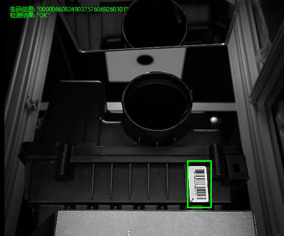
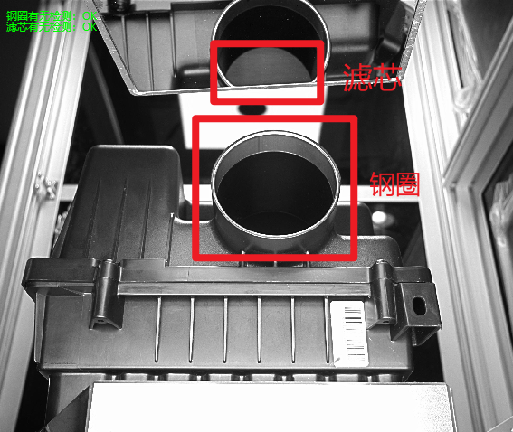
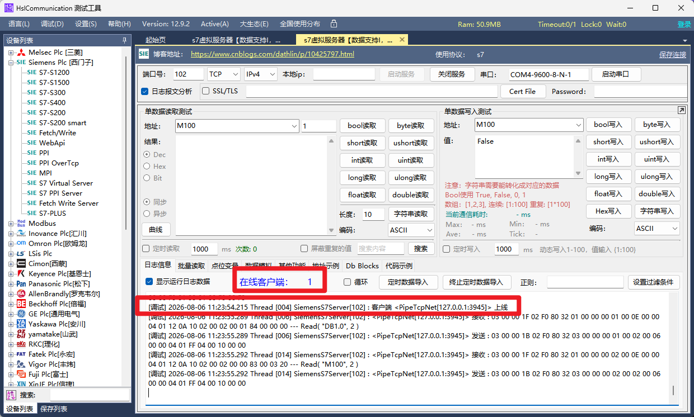

# FirstDemo-WPFwithHalcon

## C# Halcon 空滤器视觉检测系统

基于 WPF + Halcon 的工业化视觉检测上位机原型系统，模拟真实产线双工位检测与 PLC 数据交互场景。单台相机分时双曝光：低曝光检测条码，高曝光检测滤芯及钢圈有无。

---

## 核心功能

- **单工位双曝光协同检测**：单相机分时拍摄，低曝光完成条码读取，高曝光实现滤芯与钢圈缺陷判断
- **Halcon 算法集成**：形状模板匹配定位、Code 128 条码识别、Blob 分析（钢圈/滤芯有无检测）
- **工业数据交互**：基于 HslCommunication 的西门子 S7 协议通讯，支持心跳监测、信号触发与结果回写
- **多模式运行**：单张调试、批量循环、PLC 自动触发三种模式
- **实时看板与日志**：检测结果实时显示、操作日志记录、OK/NG 统计

---

## 界面展示


**界面布局**：左栏（相机连接、PLC 状态、参数调整）| 中栏（双相机采图与检测显示）| 右栏（检测结果、日志、统计）





### PLC 虚拟交互



上位机作为客户端与本地虚拟 PLC 建立心跳连接，实时记录触发指令并联动状态指示灯，实现视觉检测与工业控制的闭环。

---

## 项目结构

```
MyVisionDemo/
├── appsettings.json              # 配置文件（路径、PLC、检测参数）
├── MyVisionDemo.csproj           # 工程文件
├── MainWindow.xaml / .xaml.cs     # 主界面与交互逻辑
├── ModelID/
│   └── barcode_template.shm      # Halcon 形状模板
└── core/
    ├── AppConfig.cs               # 配置管理（加载/保存 appsettings.json）
    ├── HObjectExtensions.cs       # Halcon HObject 扩展方法
    ├── HalconProcessor.cs         # 相机1算法（形状匹配 + 条码识别）
    ├── HalconProcessor_Cam2.cs    # 相机2算法（钢圈/滤芯有无检测）
    └── HikCameraManager.cs        # 海康相机管理
```

---

## 配置说明

所有参数通过 `appsettings.json` 管理，无需修改代码：

```json
{
  "Paths": {
    "TemplatePath": "ModelID/barcode_template.shm"
  },
  "PLC": {
    "IpAddress": "127.0.0.1",
    "TriggerAddress": "M100",
    "TriggerValue": 256,
    "ResultAddress": "M200",
    "AutoReconnect": true
  },
  "Detection": {
    "MinScore": 0.65,
    "RoiOffset": 300,
    "Cam2SteelRingAreaThreshold": 20000
  }
}
```

首次运行时自动在 exe 目录生成默认配置文件。

---

## 技术栈

| 类别 | 技术 |
|------|------|
| 视觉算法 | Halcon 23.05 Progress（模板匹配、条码识别、Blob 分析） |
| 上位机 UI | WPF / XAML / MaterialDesignInXAML |
| 工业通讯 | HslCommunication（西门子 S7 协议） |
| 相机 SDK | 海康 MVS（MvCameraControl.Net） |
| 开发环境 | Visual Studio 2022, .NET 8.0 |
| 配置管理 | Newtonsoft.Json + appsettings.json |

---

## 快速开始

1. **环境准备**：安装 Halcon 23.05、海康 MVS、Visual Studio 2022（含 .NET 8 SDK）
2. **克隆仓库**：`git clone https://github.com/grapefruit3c/FirstDemo-WPFwithHalcon.git`
3. **打开项目**：用 Visual Studio 2022 打开 `MyVisionDemo.sln`
4. **配置 DLL 路径**：如有必要，在 `.csproj` 中修改 Halcon 和 MVS 的 `<HintPath>` 为你本机的安装路径
5. **编译运行**：F5 启动，首次运行会在 exe 目录生成 `appsettings.json`
6. **配置参数**：根据实际环境修改 `appsettings.json` 中的 PLC 地址、图片路径等

---

## 架构设计

- **UI 与算法分离**：Halcon 算法封装在 `core/` 目录的独立类中，与 UI 完全解耦
- **配置外部化**：所有路径、PLC 参数、检测阈值通过 `appsettings.json` 管理
- **资源规范化**：HObject 使用扩展方法和 `using` 模式管理生命周期，避免内存泄漏
- **PLC 健壮性**：支持断线自动重连，心跳丢失后定时尝试恢复连接
- **线程安全**：相机回调使用 `BeginInvoke` 异步更新 UI，检测算法使用局部变量保证线程安全

---

## 更新记录

详见 [CHANGELOG.md](CHANGELOG.md)

---

## 项目总结

本系统通过单相机工位两次拍照视觉检测的架构，展示了将 Halcon 算法集成至 C# WPF 工业软件中的完整能力。系统成功模拟了多相机协作、PLC 信号握手、视觉结果回传等典型产线场景。
