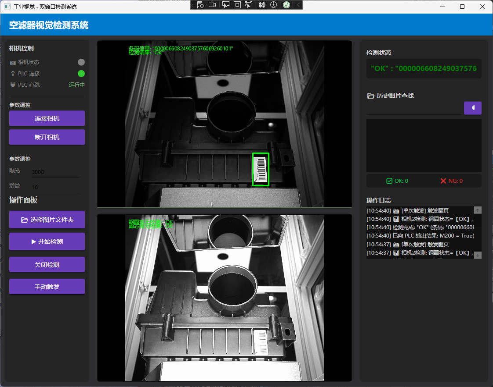

# FirstDemo-WPFwithHalcon

## C# Halcon 空滤器视觉检测系统

基于 WPF + Halcon 的工业化视觉检测上位机系统，模拟真实产线双工位检测与 PLC 数据交互场景。单台相机分时双曝光：低曝光检测条码，高曝光检测滤芯及钢圈有无。

---

## 核心功能

- **单工位双曝光协同检测**：低曝光完成条码读取，高曝光实现滤芯与钢圈缺陷判断
- **Halcon 算法集成**：形状模板匹配定位、Code 128 条码识别、Blob 分析（钢圈/滤芯有无检测）
- **工业数据交互**：西门子 S7 协议通讯，心跳监测 + 断线自动重连 + 信号触发 + 结果回写
- **生产统计**：OK/NG 实时计数、良率自动计算（颜色预警）、检测耗时统计
- **图像自动存档**：按 日期/OK或NG/时间戳 分目录保存，支持历史搜索
- **生产日志 CSV**：每周期记录检测详情，按日期分文件
- **多模式运行**：单张调试、批量循环、PLC 自动触发

---

## 界面展示



**三栏布局**：
- 左栏：设备状态（相机/PLC/心跳）→ 检测计时 → 操作面板
- 中栏：双 Halcon 窗口（条码检测 + 有无检测）
- 右栏：检测状态 → 生产统计（良率/OK/NG/总数）→ 操作日志 → 历史搜索

---

## 项目结构

```
MyVisionDemo/
├── appsettings.json              # 配置文件（路径、PLC、检测、存档、日志参数）
├── MyVisionDemo.csproj
├── MainWindow.xaml / .xaml.cs     # 主界面（统计看板 + 计时 + 日志）
├── ModelID/
│   └── barcode_template.shm      # Halcon 形状模板
└── core/
    ├── AppConfig.cs               # 配置管理
    ├── HObjectExtensions.cs       # Halcon 扩展方法
    ├── HalconProcessor.cs         # 相机1算法（形状匹配 + 条码识别）
    ├── HalconProcessor_Cam2.cs    # 相机2算法（钢圈/滤芯检测）
    ├── HikCameraManager.cs        # 海康相机管理
    ├── ProductionLogger.cs         # CSV 生产日志
    ├── ImageArchiver.cs            # 图像自动存档
    └── DetectionStats.cs           # 统计计数 + 计时器
```

---

## 配置说明

所有参数通过 `appsettings.json` 管理：

| 配置段 | 说明 | 关键参数 |
|--------|------|---------|
| Paths | 文件路径 | 模板路径 |
| PLC | PLC 通信 | IP、触发地址、结果地址、心跳、自动重连 |
| Detection | 检测算法 | 匹配分数、ROI 偏移、面积阈值、灰度阈值 |
| Camera | 相机 | 循环间隔、最大日志数 |
| Archive | 图像存档 | 存档开关、保存 OK/NG 图、JPG 质量 |
| Logging | 生产日志 | 日志开关、日志目录 |

首次运行时自动在 exe 目录生成默认配置。

---

## 技术栈

| 类别 | 技术 |
|------|------|
| 视觉算法 | Halcon 23.05 Progress |
| 上位机 UI | WPF / MaterialDesignInXAML |
| 工业通讯 | HslCommunication（西门子 S7） |
| 相机 SDK | 海康 MVS |
| 开发环境 | Visual Studio 2022, .NET 8.0 |

---

## 快速开始

1. 安装 Halcon 23.05、海康 MVS、Visual Studio 2022（含 .NET 8 SDK）
2. 克隆仓库：`git clone https://github.com/grapefruit3c/FirstDemo-WPFwithHalcon.git`
3. 用 Visual Studio 2022 打开 `MyVisionDemo.sln`
4. 如需要，在 `.csproj` 中修改 Halcon 和 MVS 的 DLL 路径
5. F5 编译运行，首次运行自动生成 `appsettings.json`
6. 修改配置文件中的 PLC 地址、检测参数等

---

## 更新记录

详见 [CHANGELOG.md](CHANGELOG.md)

- **v2.1**：生产功能（统计/存档/CSV/计时）+ UI 深色主题优化
- **v2.0**：代码全面优化（配置外部化/资源管理/PLC 重连/线程安全）
- **v1.0**：初始版本
